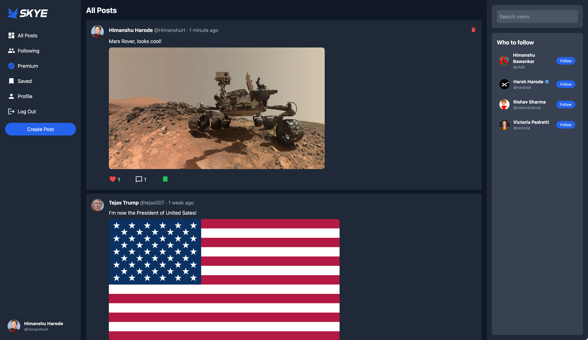
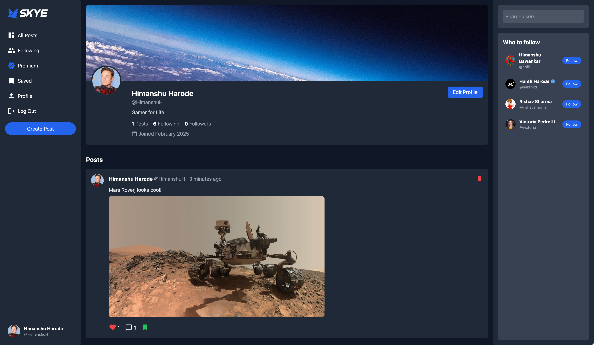

# Skye - Social Media Platform

A modern social networking platform built with Django and TailwindCSS, featuring a Twitter/X inspired interface with enhanced user experience and premium features.




## Table of Contents

- [Features](#features)
- [Tech Stack](#tech-stack)
- [Getting Started](#getting-started)
- [Environment Variables](#environment-variables)
- [Key Features](#key-features)
- [Contributing](#contributing)
- [License](#license)

## Features

- **User Authentication:** Secure registration and login system
- **Profile Management:** Customizable profiles with profile pictures and bio
- **Post Creation:** Share text and image content
- **Social Interactions:** Like, comment, and save posts
- **Follow System:** Follow/unfollow users and view their content
- **Premium Features:** Verified badges and exclusive features
- **Responsive Design:** Mobile-first approach with dark theme

## Tech Stack

- **Backend:** Django
- **Frontend:** TailwindCSS, JavaScript
- **Database:** SQLite
- **Payment Integration:** Razorpay
- **Icons:** Google Material Icons
- **Email:** SMTP Integration

## Getting Started

### Prerequisites

- Python 3.8 or higher
- pip (Python package manager)
- Node.js and npm (for TailwindCSS)

### Installation

1. **Clone the repository:**
   ```bash
   git clone https://github.com/himanshudbg/skye.git
   cd sky
   ```

2. **Create and activate virtual environment:**
   ```bash
   python -m venv env
   source env/bin/activate
   ```

3. **Install dependencies:**
   ```bash
   pip install -r requirements.txt
   pip install python-dotenv
   ```

4. **Set up environment variables:**
   Create a `.env` file in the root directory with the following variables:
   ```plaintext
   # Django Settings
   SECRET_KEY=your_secret_key_here
   DEBUG=True
   ALLOWED_HOSTS=localhost,127.0.0.1

   # Media Settings
   MEDIA_URL=/media/
   MEDIA_ROOT=network/media

   # Email Settings
   EMAIL_BACKEND=django.core.mail.backends.smtp.EmailBackend
   EMAIL_HOST=smtp.gmail.com
   EMAIL_PORT=587
   EMAIL_USE_TLS=True
   EMAIL_HOST_USER=your_email@gmail.com
   EMAIL_HOST_PASSWORD=your_app_password

   # Razorpay Settings
   RAZORPAY_KEY_ID=your_razorpay_key_id
   RAZORPAY_KEY_SECRET=your_razorpay_secret_key
   RAZORPAY_CURRENCY=INR
   PREMIUM_PRICE=99900
   ```

5. **Apply migrations:**
   ```bash
   python manage.py makemigrations
   python manage.py migrate
   ```

6. **Create superuser:**
   ```bash
   python manage.py createsuperuser
   ```

7. **Run the development server:**
   ```bash
   python manage.py runserver
   ```

## Environment Variables

### Required Variables:

1. **Django Settings:**
   - `SECRET_KEY`: Django secret key
   - `DEBUG`: Set to True for development
   - `ALLOWED_HOSTS`: Comma-separated list of allowed hosts

2. **Media Settings:**
   - `MEDIA_URL`: URL prefix for media files
   - `MEDIA_ROOT`: Directory where media files are stored

3. **Email Settings:**
   - `EMAIL_BACKEND`: Email backend configuration
   - `EMAIL_HOST`: SMTP server host
   - `EMAIL_PORT`: SMTP server port
   - `EMAIL_USE_TLS`: Enable/disable TLS
   - `EMAIL_HOST_USER`: Email address
   - `EMAIL_HOST_PASSWORD`: Email app password

4. **Razorpay Settings:**
   - `RAZORPAY_KEY_ID`: Razorpay API key ID
   - `RAZORPAY_KEY_SECRET`: Razorpay secret key
   - `RAZORPAY_CURRENCY`: Currency code (default: INR)
   - `PREMIUM_PRICE`: Premium subscription price in paise

## Key Features

### User System
- Custom user model with extended profile features
- Email verification system
- Premium subscription management
- Profile customization with bio and profile picture

### Content Management
- Create, edit, and delete posts
- Support for text and image content
- Comment system on posts
- Save posts for later viewing
- Like/unlike functionality

### Social Features
- Follow/unfollow system
- Dedicated following feed
- User suggestions
- Search functionality
- Real-time user interactions

### Premium Features
- Verified badge for premium users
- Priority in search results
- Exclusive features access
- Razorpay payment integration

### User Interface
- Responsive design for all devices
- Twitter-inspired layout
- Dark theme
- Mobile-optimized navigation
- Clean and intuitive interface

## Contributing

1. Fork the repository
2. Create your feature branch: `git checkout -b feature/AmazingFeature`
3. Commit your changes: `git commit -m 'Add some AmazingFeature'`
4. Push to the branch: `git push origin feature/AmazingFeature`
5. Open a Pull Request

## License

This project is licensed under the MIT License.

## Acknowledgments

- **Django:** For providing a robust web framework
- **TailwindCSS:** For the modern and responsive design system
- **Google Material Icons:** For the comprehensive icon set
- **Razorpay:** For secure payment integration
- **Twitter/X:** For interface inspiration
- **CS50W:** For project inspiration and guidance
- **Open Source Community:** For various tools and libraries used in this project
```